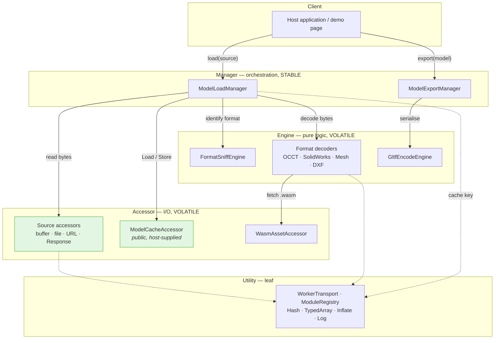
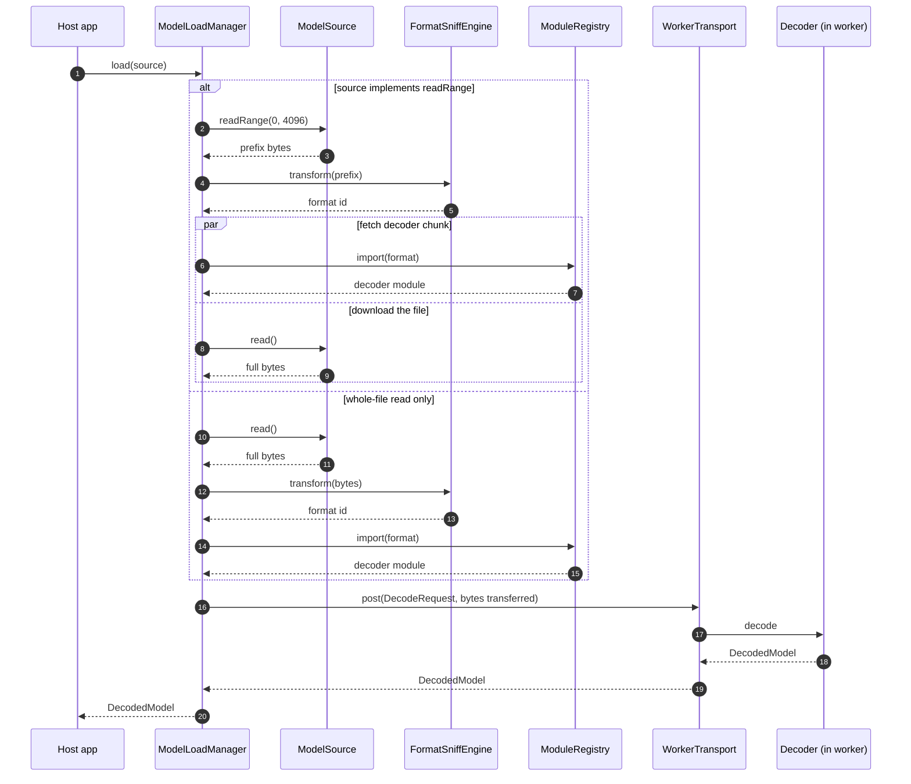
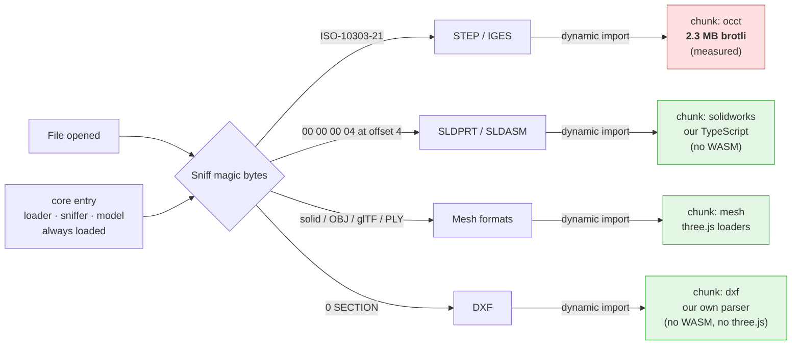
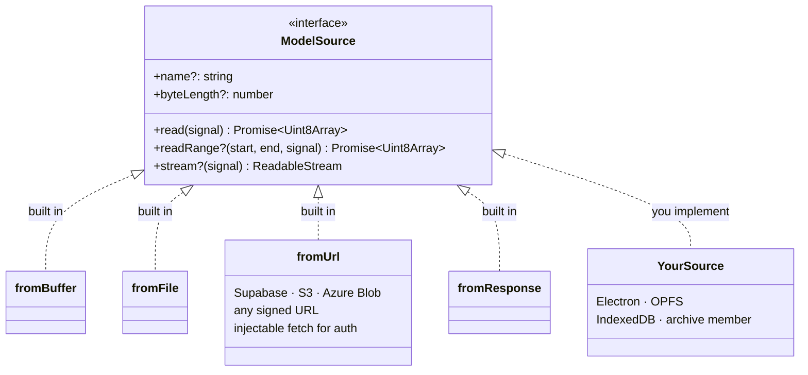
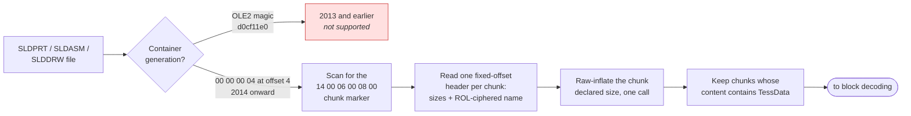
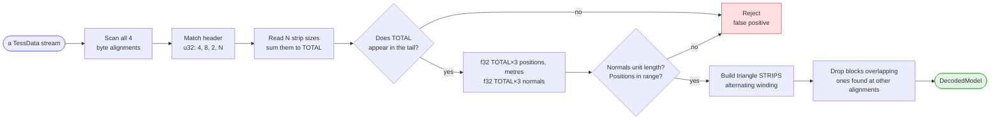

# Architecture

How this library is put together, and why. Every diagram here has been rendered
and checked. The reasoning behind each choice is in `DECISIONS.md`; the build
plan is in `SPEC.md`.

Read this first if you are new to the codebase.

---

## 1. The shape in one sentence

A caller hands us a source of bytes. We work out what format it is, load only
the decoder that format needs, decode it off the main thread, and hand back a
renderer-agnostic model.

Nothing is uploaded. All conversion happens in the browser.

---

## 2. Layers

The decomposition follows iDesign: components are grouped by **what is likely
to change**, not by what they do.

- **Volatile** — format decoders (SolidWorks alone differs between its 2018 and
  2020 containers), byte sources (a file picker today, object storage
  tomorrow), and the renderer (three.js ships breaking changes).
- **Stable** — the load sequence, and the shape of the decoded model.

So decoders, sources and renderers are the replaceable edges. The orchestration
and the model are the core, and the core never learns their names.

The three.js adapter (`/three`, SPEC.md section 7a) sits outside the graph
below entirely, rather than as a sixth layer: it depends only on the neutral
model (Common), never on Manager, Engine or Accessor, so a caller doing
headless work — thumbnails, measurement, export — never pulls in three.js
(D10, SPEC.md section 8). One sibling follows the exact same shape: `/2d`
(D6, WAYFINDER.md), the equivalent adapter for a 2D drawing's `LineSegments`
— depending only on Common, so headless work never pulls it in for free
either. `no-three-adapter-outbound` and `no-2d-adapter-outbound` in
`.dependency-cruiser.js` enforce this the same way the table below enforces
everything else.



The two green components are **public interfaces you implement**. Everything
else is internal.

Dotted lines are calls into Utility, which every layer may use and which calls
nothing itself.

### The rules, and the guard

| Allowed | Forbidden |
| --- | --- |
| Client to Manager | Client to Engine or Accessor |
| Manager to Engine, Manager to Accessor | Manager to Manager |
| Engine to Accessor | Engine to Engine, Engine to Manager |
| Anything to Utility | Accessor to anything but Utility |
| `/three` adapter to Common (only) | `/three` adapter to Manager, Engine, Accessor or Utility |
| `/2d` adapter to Common (only) | `/2d` adapter to Manager, Engine, Accessor or Utility |

A layering rule that lives only in a document drifts, and it still compiles.
These **will be** enforced with `dependency-cruiser`, so a boundary-crossing
import fails the build. That guard is not wired up yet: it arrives with the
toolchain in build slice 1, because there is no TypeScript source to check.

Two consequences that look odd until you see the rule behind them:

- `ModelExportManager` is separate from `ModelLoadManager`, because Manager
  must never call Manager.
- `GltfEncodeEngine` is separate from the decoders. Export is not decoding
  run backwards, and Engine must never call Engine.

---

## 3. Loading a file

The interesting part is the fast path. A source that can serve a byte range
lets us sniff the format from a small prefix, then fetch the decoder **at the
same time** as the file downloads.

That matters because the OCCT decoder is 2.3 MB brotli. Overlapping it with a
large download removes a whole round trip before anything appears.



Bytes are **transferred**, not copied, when they cross into the worker. A
transferred `ArrayBuffer` is detached on the sending side, so the Manager must
not touch the buffer afterwards.

### Why the worker is a Utility, and why the Manager stays on the main thread

Decoding cannot run on the main thread: a 4.6 MB STEP file takes 8.4 seconds.
So something has to cross into a worker. The question is what.

**Why not an Accessor.** A worker looks like an I/O boundary, so making
`WorkerTransport` an Accessor is tempting. Two objections. First, it breaks the
call graph: the Manager would call an Accessor which calls an Engine, and
Accessor-to-Engine is forbidden. Second, and more fundamental, an Accessor
answers a *domain* question — "give me the bytes for this source", "fetch the
WebAssembly binary". A worker answers none. It carries a message from one thread
to another and has no opinion about what the message means. That is the
definition of a cross-cutting concern, which is a Utility.

**Why not move everything into the worker.** The cleaner-looking alternative is
to run the whole Manager and Engine stack worker-side, leaving a thin facade on
the main thread. Then there is one boundary, at the very top, and no proxies.

That does not work, for a concrete reason: **the source layer cannot cross the
boundary.** A caller-supplied `fetch` is a function, and a user-implemented
`ModelSource` is an object with methods. Neither survives the structured clone
algorithm, which copies data and rejects functions and class prototypes. So
sources must stay on the main thread. The Manager calls sources, so the Manager
stays too, and only the Engines move.

That constraint is not a limitation we worked around; it is what fixes the
design. Sources are the layer we deliberately made public and extensible
(section 5), and extensibility means arbitrary caller code, which means the main
thread.

**So the worker is transport, not a layer.** Each Engine has a thin main-thread
proxy implementing the same interface, forwarding over `WorkerTransport` to the
real implementation worker-side. The Manager still calls an Engine.

```
main thread                       worker
-----------                       ------
ModelLoadManager
  -> OcctDecodeEngineProxy
       -> WorkerTransport   ==>   OcctDecodeEngine
                                    -> WasmAssetAccessor
```

---

## 4. Format dispatch and bundle size

One package. Each decoder sits behind a dynamic `import()`, so a bundler splits
it into its own chunk and a caller downloads only what a file actually needs.

The numbers below are measured on this repository, not estimated.



**The SolidWorks signature is bytes 4 to 7, not bytes 0 to 3.** Every file in
the NIST corpus has a *different* first word — it looks like a per-file id or
hash — while `00 00 00 04` at offset 4 is constant across all eleven. Sniffing
on the leading word matches one file and rejects the other ten, and the failure
looks like an unsupported format rather than a bug.

Someone viewing an STL never fetches the OCCT WebAssembly build. That is the
whole reason for the split: shipping one bundle would charge every consumer
about 3 MB before anything appeared on screen, which for a library other people
embed is disqualifying.

**The cost we accepted.** A dynamically imported `.wasm` asset has to be emitted
and served rather than inlined, and that is the part sensitive to bundler
configuration. `WasmAssetAccessor` therefore lets the caller override the asset
URL, and the setup is documented for Vite, webpack and a plain script tag.

---

## 5. Sources

Sources are a volatile edge, so the Accessor contract is **public**. The library
knows how to read bytes. It does not know where bytes live, and it must not
learn.



Only `read()` is required. Every v1 decoder needs the whole buffer anyway: OCCT
takes the complete file, the SolidWorks decoder scans the entire container for
nested streams, and the DXF parser buffers before parsing. `readRange` and
`stream` are capabilities that unlock the fast path and progress reporting.

**There is no Supabase adapter and no storage dependency.** Supabase, S3 and
Azure Blob all reduce to a signed URL through `fromUrl`. The `fetch` option on
that one source exists so a caller can attach an `Authorization` header; we
never hold a token.

---

## 6. Decoding SolidWorks

This is the part with no prior art, so it is documented in detail. The format
was recovered by inspection; `research/FINDINGS.md` and `DECISIONS.md` record
how, including the three wrong turns.

### Stage 1 — open the container



`SolidWorksContainerUtil.ts` reads this container structure directly — a real
chunk format (marker, fixed header, ROL-ciphered name, then one raw-deflate
payload of exactly the declared size), not the blind byte-by-byte inflate
attempt this project ran before WAYFINDER.md's D14. That was never a
container parser at all: it tried decompression at every offset of the whole
file, recursively, because nobody had reverse-engineered this structure yet.
The record layout came from `openswx`'s (MIT, github.com/schwitters/openswx)
own `ParseModernFormat` source, read directly rather than assumed, then
validated against every real SLDPRT/SLDDRW sample this project has access
to. Concrete difference: the same NIST part that took 45-60 seconds to
extract under the old scan now takes 2-5 milliseconds, and a SolidWorks
*drawing* — which the old scan could take several minutes on, or hang
outright — decodes in under a second even at 13.5 MB. See DECISIONS.md and
WAYFINDER.md's D12-D14 for the investigation.

Filtering by the `TessData` substring inside a chunk's decompressed content
(rather than trusting a specific chunk name) is deliberate: a part's cache
lives in a chunk named `Contents/DisplayLists`, a drawing's in
`Contents/VBLists` — different document types, different names, same
content fingerprint. Content-sniffing is what generalizes across them
without hardcoding either name.

### Stage 2 — decode a tessellation block



### Record layout

```
u32  4, 8, 2, N          marker, N = number of triangle strips
u32  size[0..N-1]        vertices per strip, summing to TOTAL
u32  a, b, 2, TOTAL      tail, ending with the vertex total
f32  TOTAL * 3           vertex positions, metres
f32  TOTAL * 3           per-vertex normals
```

### Three things that will bite you

Each of these cost a debugging round, so they are written down rather than
rediscovered.

1. **Runs are strips, not fans.** Fanning a run from its first vertex collapses
   a cylindrical hole wall onto a point, and every hole renders as a cone.
2. **Headers are not always word-aligned.** Reading the stream only as
   word-aligned `u32` misses every header in some files. The symptom is a scan
   that reports *no rejections at all*, because it never saw a candidate.
   Zero rejections is a different bug from many rejections.
3. **Small integers look like coordinates.** Read as `float32`, the integer 7
   is a denormal near 1e-44. Any "is this a plausible coordinate" test that
   only checks an upper bound will accept index arrays as vertices.

   Two defences work. Check a lower bound as well, which is what
   `d8-final.py` and `d9-decode-tess.py` do. Or require the paired normals to
   be unit length, which is what `d9-decode.py` relies on instead — an index
   array read as normals never has unit length. Do not assume the shipped
   decoder checks a lower bound; it does not, and does not need to.

### What is verified, and what is not

7 of 11 NIST parts reproduce the bounding box measured independently from their
STEP twin with OCCT, several to two decimal places. The remaining four decode
the part correctly but report an oversized box, because the cache also holds
tessellated PMI annotation geometry.

This was 6 of 11 until 2026-09-07. `nist_ftc_11`, recorded here as a genuine
unexplained miss, now passes: an overly strict tessellation-block validity
check was rejecting a real block. See WAYFINDER.md's D16 for the measurement.
Section 6a below and `research/FINDINGS.md` deliberately keep the older figure,
because they record what was measured at the time, not the current result.

Verified on SolidWorks 2018 and 2020, parts only. Assemblies are untested.

**Container-level extraction (Stage 1 above) is no longer part-specific —
Stage 2 onward still is.** `SolidWorksContainerUtil.ts` decodes real SLDDRW
drawing files end to end with no errors and a plausible mesh, using the
identical code path as SLDPRT (WAYFINDER.md's D14). That is not the same
claim as this section's own bounding-box verification above: nobody has yet
checked a decoded drawing's geometry against independent ground truth the
way the NIST parts are checked here, and whether SLDDRW joins v1 as a
supported format is a separate, still-open product decision (WAYFINDER.md's
D12) — this note is about what the code does, not what the product
promises.

---

## 6a. Caching a decoded result

### Which layer is it?

**An Accessor.** A cache answers `Load` and `Store`, which are literally the
Accessor semantic methods, and it is I/O with domain meaning. Like
`ModelSource`, `ModelCacheAccessor` is a **public interface the host
implements**, because we have no idea what storage a host has.

The *policy* — check the cache, decode on a miss, store the result — is
orchestration, so it lives in `ModelLoadManager`. The Accessor only moves bytes.

That split matters for one specific reason: **the cache key needs the decoder
version, and only the library knows that.** If the host computed its own key
outside the library, it could not include the one field most likely to
invalidate an entry. So the library computes the key and the host stores by it.

The easy half is writing the file. The hard half is knowing when the cached copy
is stale, so the cache key has to include more than the file.

```
cacheKey = hash(file bytes) + decoderName + decoderVersion + optionsHash
```

Every part earns its place:

- **File hash**, not path or timestamp. The same part gets re-saved, moved and
  renamed constantly, and a modification time tells you nothing useful about CAD
  files that get copied between machines.
- **Decoder version.** This one is not theoretical. Our SolidWorks decoder went
  from 3 of 11 NIST parts correct to 6 of 11 in a single change. Every result
  cached before that fix was wrong, and nothing about the file changed. A cache
  keyed only on content would have served those bad results forever.
- **Options hash.** Tessellation tolerance and similar settings change the
  output for identical input.

Treat the cache as disposable. A miss costs one parse; a stale hit shows the
wrong geometry, and nobody looking at it will know.

### One wrinkle: hashing needs the whole file

A content hash requires all the bytes, so a cache lookup keyed on it cannot
happen until the download finishes. That throws away most of the benefit, since
the download is often the slow part.

The fix is to let a source offer a cheaper identity when it has one. Object
stores hand out an ETag or version id for free:

```ts
interface ModelSource {
  /** A strong identity from the storage layer, when one exists. */
  readonly etag?: string;
  // …
}
```

When `etag` is present the loader can check the cache **before downloading
anything**, and a hit skips the transfer as well as the parse. When it is
absent, we fall back to hashing the bytes we already had to fetch.

---

## 7. The decoded model

Renderer-agnostic by design, and shared by every layer, so it lives in
`Common`.

```ts
interface DecodedModel {
  readonly units: 'mm';
  readonly meshes: readonly DecodedMesh[];
  readonly tree: readonly SceneNode[];      // assembly structure
  readonly metadata: Readonly<Record<string, string>>;
  readonly preview?: Uint8Array;            // embedded thumbnail, if present
  readonly diagnostics: readonly Diagnostic[];
}

interface DecodedMesh {
  readonly positions: Float32Array;
  readonly normals: Float32Array;
  readonly indices: Uint32Array;
  readonly faces: readonly FaceRange[];     // CAD identity
  readonly name?: string;
  readonly color?: readonly [number, number, number];
}

interface FaceRange {                       // one original CAD face
  readonly id: number;
  readonly start: number;
  readonly count: number;
  readonly color?: readonly [number, number, number];
}
```

`faces` carries CAD identity. Both decoders produce it for free: OCCT returns a
`brep_faces` mapping, and the SolidWorks decoder knows its strip boundaries. It
is what makes face picking, per-face colour and measurement possible later, and
adding it afterwards would change the returned shape.

`diagnostics` exists because of a measured failure. An AP242 tessellated STEP
file parses with `success: true` and **zero meshes**, so a naive viewer shows an
empty screen and reports success. Silent success is the worst failure mode a
viewer can have, so decoders must report it.

---

## 8. Limits, stated up front

- **Very large assemblies will not open.** Browser-only conversion is a
  deliberate trade for privacy and zero hosting.
- **SolidWorks support is partial.** See section 6.
- **SolidWorks files carry confidential data in plaintext** — customer folder
  paths, user names, part numbers. The library must never log file contents.
- **2013-and-earlier SolidWorks files are OLE2** and are not supported.
